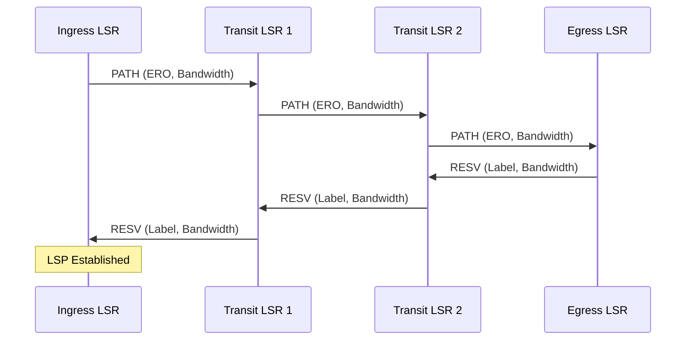

## RSVP TE

```mermaid
sequenceDiagram
    participant Ingress LSR
    participant Transit LSR 1
    participant Transit LSR 2
    participant Egress LSR

    Ingress LSR->>Transit LSR 1: PATH (ERO, Bandwidth)
    Transit LSR 1->>Transit LSR 2: PATH (ERO, Bandwidth)
    Transit LSR 2->>Egress LSR: PATH (ERO, Bandwidth)

    Egress LSR->>Transit LSR 2: RESV (Label, Bandwidth)
    Transit LSR 2->>Transit LSR 1: RESV (Label, Bandwidth)
    Transit LSR 1->>Ingress LSR: RESV (Label, Bandwidth)
    
    Note over Ingress LSR: LSP Established
```
