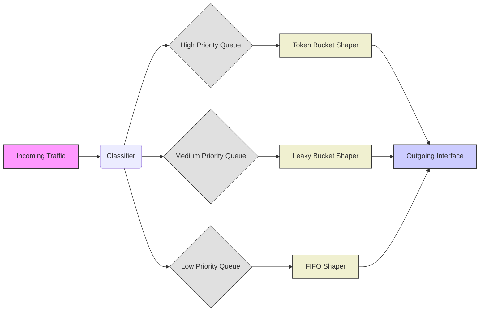

## Routing based on Traffic Classification 

```mermaid
graph LR
    A[Incoming Traffic] --> B(Classifier);
    B --> C{High Priority Queue};
    B --> D{Medium Priority Queue};
    B --> E{Low Priority Queue};
    C --> F[Token Bucket Shaper];
    D --> G[Leaky Bucket Shaper];
    E --> H[FIFO Shaper];
    F --> I[Outgoing Interface];
    G --> I;
    H --> I;
    style A fill:#f9f,stroke:#333,stroke-width:2px
    style I fill:#ccf,stroke:#333,stroke-width:2px
    classDef queue fill:#e0e0e0,stroke:#333,stroke-width:1px
    class C,D,E queue
    classDef shaper fill:#f0f0d0,stroke:#333,stroke-width:1px
    class F,G,H shaper
```
